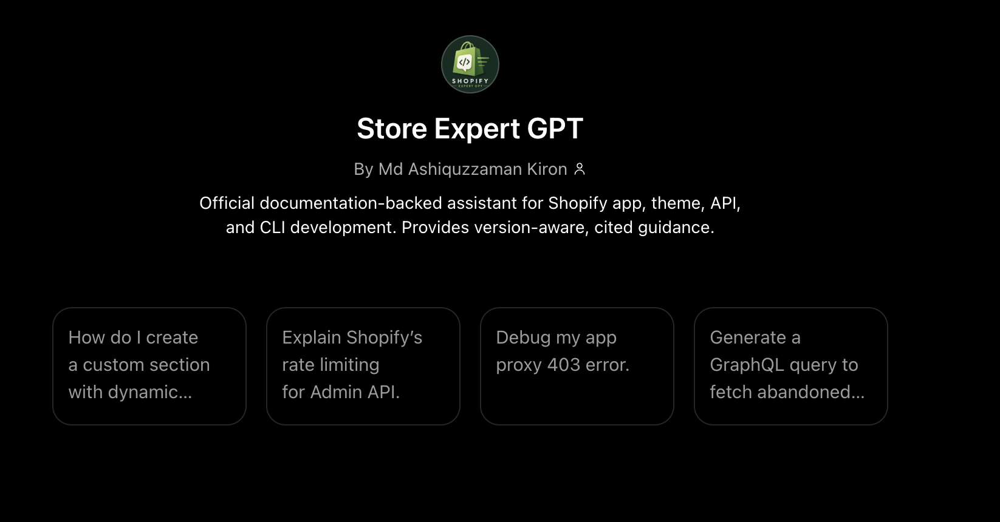

# 📘 Shopify Expert GPT Knowledge Base

## 🎯 Overview
Production-ready RAG dataset optimized for OpenAI GPT Builder. Covers official Shopify documentation patterns for **Online Store 2.0 themes**, **CLI v3 apps (Remix)**, **GraphQL/REST Admin APIs**, **Checkout Extensions**, **Functions**, and **security/compliance workflows**. Designed to deliver accurate, cited, and copy-paste-ready scaffolding.

### Screenshot one - Custom GPT app screenshot 

## 📁 Folder Structure & Content Map
| Directory | Purpose |
|-----------|---------|
| `00_system_config/` | Core behavior rules, compliance scope, and system prompt |
| `01_liquid_and_themes/` | Consolidated Liquid, Online Store 2.0 theme, schema, and metafields guide |
| `02_admin_graphql_api/` | Consolidated GraphQL Admin API guide |
| `03_admin_rest_api/` | Consolidated REST Admin API guide |
| `04_app_development_cli/` | Consolidated Shopify CLI v3 + Remix guide |
| `05_storefront_and_checkout/` | Consolidated storefront, checkout, and functions guide |
| `06_merchant_and_partner_ops/` | Consolidated partner operations, billing, app review, and deployment guide |
| `07_security_and_best_practices/` | Consolidated OAuth, security, rate limit, retry, and privacy guide |
| `08_scaffolding_reference/` | Standard boilerplate patterns for themes, apps, webhooks, and proxies |

## 🧩 Consolidated Knowledge Structure
To reduce fragmentation and improve GPT retrieval quality, related markdown files were merged into larger topic-focused guides.

| New Consolidated File | Covers |
|---|---|
| `01_liquid_and_themes/liquid_and_themes_complete_guide.md` | Liquid syntax, Online Store 2.0 architecture, section/block schema, metafields, dynamic sources |
| `02_admin_graphql_api/admin_graphql_api_complete_guide.md` | Auth, queries, mutations, pagination, rate limits, webhooks |
| `03_admin_rest_api/admin_rest_api_complete_guide.md` | REST auth, scopes, endpoints, pagination, retry/error handling |
| `04_app_development_cli/shopify_cli_and_remix_complete_guide.md` | CLI v3 setup, Remix structure, embedded apps, proxies, TOML config |
| `05_storefront_and_checkout/storefront_checkout_and_functions_complete_guide.md` | Storefront API, Buy Button, Checkout UI Extensions, Shopify Functions |
| `06_merchant_and_partner_ops/merchant_and_partner_ops_complete_guide.md` | Partner dashboard, development stores, billing/pricing, deployment, app review |
| `07_security_and_best_practices/security_and_best_practices_complete_guide.md` | OAuth sessions, API rate limits, retry logic, data privacy, compliance |

## 🚀 Quick Setup Guide (GPT Builder)
1. **Create Files:** Replicate the exact folder structure. Most topic folders now contain one consolidated `.md` guide for cleaner GPT Knowledge retrieval.
2. **Upload:** In ChatGPT → **My GPTs** → **Create** → **Configure** → **Knowledge** → Upload all `.md` files (drag entire folder).
3. **Capabilities:** Enable ✅ Web Search, ✅ Code Interpreter, ✅ File Upload. Disable ❌ DALL-E.
4. **System Prompt:** Copy contents of `00_system_config/system_prompt.md` into the **Instructions** field (stays well under 8,000 chars).
5. **Publish:** Set visibility → Test privately → Publish to GPT Store or share via link.

## 🛠 Scaffolding & Usage Workflow
- Trigger scaffolding with explicit prompts: `Scaffold a...`, `Generate boilerplate for...`
- GPT will output: CLI init command → ASCII file tree → Full file contents → Placeholders for secrets → Run/test/deploy steps
- Always verify against `shopify.dev` links provided in responses
- Use Web Search for real-time API version validation if uncertain
- For large projects, scaffold incrementally: `Start with shopify.app.toml` → `Next: shopify.server.ts` → `Then: routes/`

## 🧪 Testing & Validation Checklist
Run these prompts post-upload:
- `Scaffold an OS 2.0 theme section with dynamic metafield settings and blocks`
- `Generate a Shopify CLI v3 app with admin GraphQL auth, webhook handler, and app proxy route`
- `Explain GraphQL rate limits + provide production-ready retry logic in JS`
- `How do I configure billing for a recurring SaaS app using Shopify API?`
✅ **Success criteria:** Cites official docs, uses CLI v3/OS 2.0 standards, outputs complete files (no partial snippets), includes security warnings, and stays within response limits.

## 🔁 Maintenance & Update Schedule
- **Monthly:** Review `shopify.dev/changelog` for API/theme updates
- **Quarterly:** Replace outdated `.md` files, update `version:` frontmatter tags
- **User Feedback:** Monitor GPT Store ratings & chat logs → refine `system_prompt.md` if hallucinations occur
- **Backup:** Maintain a Git repo mirror. Use `git add -A` + commit after each update
- **Live Fallback:** Keep Web Search enabled to catch breaking changes between syncs

## ⚖️ Compliance & Limitations
- 📜 Uses publicly available Shopify documentation. Not affiliated with Shopify Inc.
- 🔒 Cannot access live stores, execute API calls, or bypass OAuth/HMAC verification
- 🚫 Never outputs secrets, tokens, or client-side credential exposure patterns
- ✅ Always reminds users to test in dev stores before production deployment
- 📏 Respects OpenAI RAG limits: <50MB/file, <100 files total, optimized chunking

## 💡 Pro Tips
- All inner code blocks use 3-backtick syntax. This file uses 4-backticks for safe copy-paste isolation.
- If GPT outputs partial code, prompt: `Output the complete file for [filename] from start to end.`
- Always run `shopify theme check` and `shopify app lint` locally before deploying generated code.
- Use `shopify app dev` for local OAuth tunneling and webhook testing.

## 🔗 Official References
- `shopify.dev/docs` → Central developer portal
- `shopify.dev/changelog` → Version & breaking change tracking
- `help.shopify.com` → Merchant & partner workflows
- `github.com/Shopify` → CLI, Dawn theme, Polaris, and open-source examples

> 📦 Ready for production. Upload, test, and deploy. Maintain quarterly. Cite sources. Build safely.
